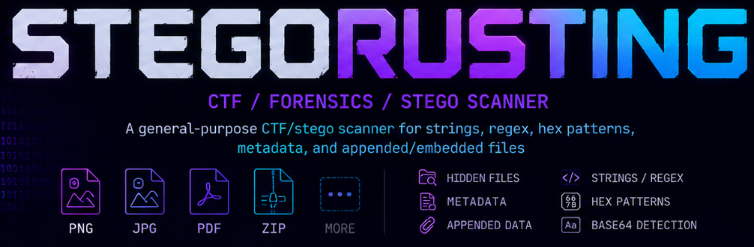

<p align="center">
  
</p>

<h1 align="center">StegoRusting</h1>

<p align="center">
  <strong>CTF / Forensics / Stego Scanner</strong>
</p>

<p align="center">
  A general-purpose CTF/stego scanner for strings, regex, hex patterns,<br>
  metadata, and appended/embedded files
</p>

<p align="center">
  
  
  
  
  
</p>

---

# 🔍 Overview

**StegoRusting** is a modern Rust-based steganography and forensic analysis tool designed for:

- CTF players
- Malware analysts
- DFIR professionals
- Reverse engineers
- Red Team operators
- Security researchers

The project focuses on discovering hidden data, suspicious metadata, embedded payloads, appended files, and secret patterns inside binaries and media files.

---

# ✨ Features

| Capability | Description |
|---|---|
| 🔎 String & Regex Search | Search literal strings and regex directly on raw bytes |
| 🧩 Embedded File Detection | Detect hidden ZIP, PDF, PE, ELF and other payloads |
| 🧠 Base64 Detection | Detect and preview decoded Base64 strings |
| 📦 Recursive Extraction | Extract nested embedded blobs recursively |
| 🧪 Structural Analysis | Detect appended payloads and malformed structures |
| 🗂️ Metadata Analysis | Analyze EXIF, XMP, PNG chunks, ZIP comments and PDF metadata |
| ⚡ Hex Pattern Search | Search custom hex signatures |
| 🎯 CTF Focused | Detect common flag formats and hidden artifacts |
| 🖥️ Cross-Platform | Windows and Linux support |
| 🦀 Built in Rust | Fast, memory-safe and lightweight |

---

# 🧠 Supported Formats

<p align="center">

| Format | Supported |
|---|---|
| PNG | ✅ |
| JPG / JPEG | ✅ |
| GIF | ✅ |
| ZIP | ✅ |
| RAR | ✅ |
| PDF | ✅ |
| PE / EXE | ✅ |
| ELF | ✅ |
| 7Z | ✅ |
| GZIP | ✅ |
| BZIP2 | ✅ |
| XZ | ✅ |
| CAB | ✅ |
| ISO | ✅ |
| DMG | ✅ |
| Mach-O | ✅ |
| RIFF | ✅ |

</p>

---

# 🚀 Installation

## Clone repository

```bash
git clone https://github.com/brunnosaid/StegoRusting.git
cd StegoRusting
```

---

## Build release

```bash
cargo build --release
```

---

## Binary locations

### Linux

```bash
./target/release/stegorusting
```

### Windows

```powershell
.\target\release\stegorusting.exe
```

---

# ⚙️ Usage

```bash
stegorusting.exe [OPTIONS] <FILE>
```

---

## Analyze a file

```bash
cargo run -- sample.png
```

---

## Search for strings

```bash
cargo run -- sample.png --word "flag{" --word "secret"
```

---

## Regex search

```bash
cargo run -- sample.png --regex "flag\{.*?\}"
```

---

## Search hex patterns

```bash
cargo run -- sample.png --hex "66 6c 61 67 7b"
```

---

## Use a custom wordlist

```bash
cargo run -- sample.png --wordlist words.txt
```

---

## Automatic extraction

```bash
cargo run -- sample.png --extract
```

---

## Recursive extraction

```bash
cargo run -- sample.png --extract --recursive
```

---

## Disable ANSI colors

```bash
cargo run -- sample.png --no-color
```

---

# 🖥️ Example Terminal Output

```text
========== STAGE 1: HEX / STRINGS / REGEX / WORDLISTS ==========

[+] Matches found: 2

[literal] word:picoCTF{
Offset : 0x23056E
Preview: ....Here is a flag: picoCTF{more_than_m33ts_the_3y37fde8891}.

========== STAGE 2: METADATA / EXIF / XMP / COMMENTS ==========

[*] JPEG APP2 at 0x14, 3158 bytes.
[*] Readable fields in JPEG-APP

========== STAGE 3: STRUCTURAL ANALYSIS ==========

[!] JPEG has 18432 bytes after EOI marker.
[!] Possible embedded file:
- ZIP archive at offset 0x1C8A40

========== STAGE 4: EXTRACTION ==========

[+] Extracted: embedded_0.zip
[+] Output directory: stegorusting_output
```

---

# 📂 Project Structure

```text
StegoRusting/
├── src/
│   └── main.rs
├── assets/
│   └── logo.png
├── docs/
│   └── EXAMPLES.md
├── Cargo.toml
├── Cargo.lock
├── LICENSE
└── README.md
```

---

# 🔮 Planned Features

- Entropy analysis
- YARA support
- WAV steganography analysis
- PNG chunk reconstruction
- Multi-threaded scanning
- Automatic archive unpacking
- Signature database
- PE section analysis
- LSB image analysis

---

# 📜 License

This project is licensed under the MIT License.
